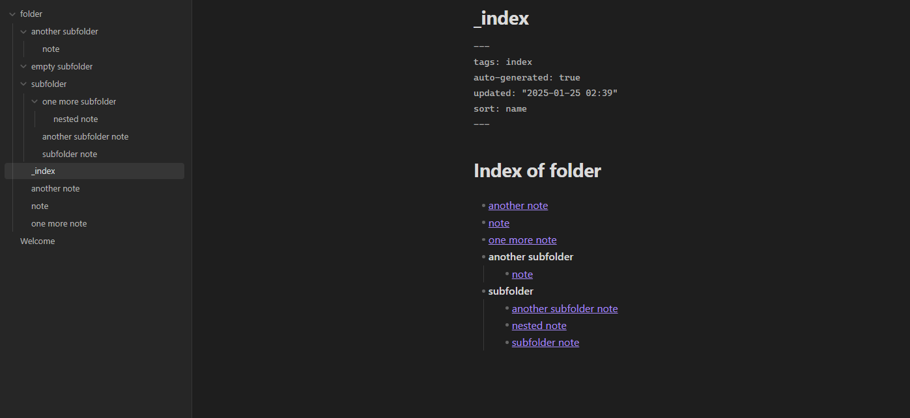
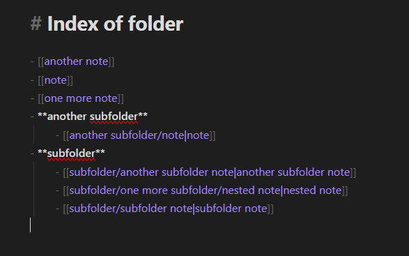
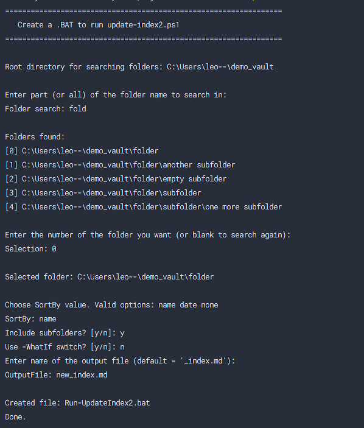

# Obsidian MOC (index) generator

A PowerShell script suite to generate customizable Map of Contents (MOCs) for Obsidian vaults. Automatically creates nested index files with real backlinks for your note hierarchy. You can see a result [here](demo_vault/folder/_index.md) or in the image below.





## **Table of contents**

- [Obsidian MOC (index) generator](#obsidian-moc-index-generator)
  - [**Table of contents**](#table-of-contents)
- [Quick Start](#quick-start)
- [Features](#features)
- [Usage](#usage)
  - [1. Generating MOCs](#1-generating-mocs)
  - [2. Customize with optional parameters](#2-customize-with-optional-parameters)
- [Automation tools](#automation-tools)
  - [1. Run multiple predefined parameters](#1-run-multiple-predefined-parameters)
  - [2. Console-based UI for `.bat` creation](#2-console-based-ui-for-bat-creation)
- [Integrate with obsidian](#integrate-with-obsidian)
- [Motivation](#motivation)
  - [Why powershell](#why-powershell)
  - [Weaknesses](#weaknesses)
- [Contributing](#contributing)

# Quick Start

1. Clone this repository or download the `src/` scripts.
2. Ensure PowerShell 5.1+ is installed ([check your version](https://aka.ms/PSVersion)).

```cmd
powershell -File src/update_index.ps1 -VaultPath "~/my_vault" -TargetFolder "Notes"
```

# Features
- Generate MOCs (indexes) for your entire vault or specific folders.
- Choose to include or exclude subfolders.
- Sort by file name, creation date, or natural file order.
- Customize the title and frontmatter YAML in the output file.
- Preview changes with a “WhatIf” mode (no files are modified).

# Usage

## 1. Generating MOCs


Run `update_index.ps1` with required parameters:

```cmd
powershell -File src/update_index.ps1 -VaultPath <path/to/vault> -TargetFolder <path/to/folder-to-be-indexed>
```

## 2. Customize with optional parameters

| Parameter           | Description                          | Default       |
|---------------------|--------------------------------------|---------------|
| `-SortBy`           | `name`, `date`, `none`               | `none`        |
| `-IncludeSubfolders`| Include subfolder files (`$true`/`$false`) | `$true` |
| `-WhatIf`           | Preview changes without writing      | `$false`      |
| `-OutputFile`       | Output filename (must be `.md`)      | `_index.md`   |


# Automation tools

Every run overwrites everything in the output file. So you can pretty much always run updates how many times you want. The output file will always be "clean", without duplicate links or broken structure.

## 1. Run multiple predefined parameters

Run multiple index updates via `parameters.json` with `controller.ps1`. It runs `update_index.ps1` in loop with all group of paramters defined in the json file, one at time. This way it is simple to control multiple updates of indexes from a single script that can be scheduled.

```cmd
powershell -File src/controller.ps1 -JsonPath parameters.json
```

```json
{
  "targetFolder": "folder",
  "sortBy": "name",
  "includeSubfolders": true,
  "whatIf": false,
  "outputFile": "_index.md",
  "vaultPath": "absolute/path/to/demo_vault" // I advise for absolute paths here, but it can run with relative path
},
```

## 2. Console-based UI for `.bat` creation

Generate single-use scripts via interactive prompt. Makes  automation with schedulers easy:

Examples of output files are [here](outputs/indexGenerator_demo_vault_folder.bat) and [here](outputs/indexGenerator_demo_vault_subfolder.bat)



# Integrate with obsidian

1. [**Shell commands**](https://github.com/Taitava/obsidian-shellcommands)
   - Install from Obsidian community plugins tab or manually
   - Create a shell command that runs your newly generated `.bat` files or directly calls `controller.ps1.`
   - Trigger index updates directly from Obsidian.


2. Scheduled tasks
  - Use Task Scheduler on Windows or cron on Linux to run `controller.ps1` or your `.bat` scripts at intervals.
   
# Motivation

I couldn’t find an existing Obsidian plugin that generates simple MOCs in a fully customizable way. Plugin-based solutions either forced naming conventions or generated links that don’t behave like “real” links in graph view. I needed something straightforward and flexible—hence this script.


## Why powershell

I wanted a cross-platform solution that’s straightforward to schedule on Windows. PowerShell 5.1+ runs on Windows, macOS, and Linux, so it fits well for automation. (And, honestly, because I know nothing about JavaScript)


## Weaknesses

- Not an official Obsidian plugin (though it can be integrated with existing plugins or scheduling tools).
- Requires a manual or scheduled run every time you add files or want a new MOC.

# Contributing

- I would love this *javscripted* into an obsidian community plugin- 